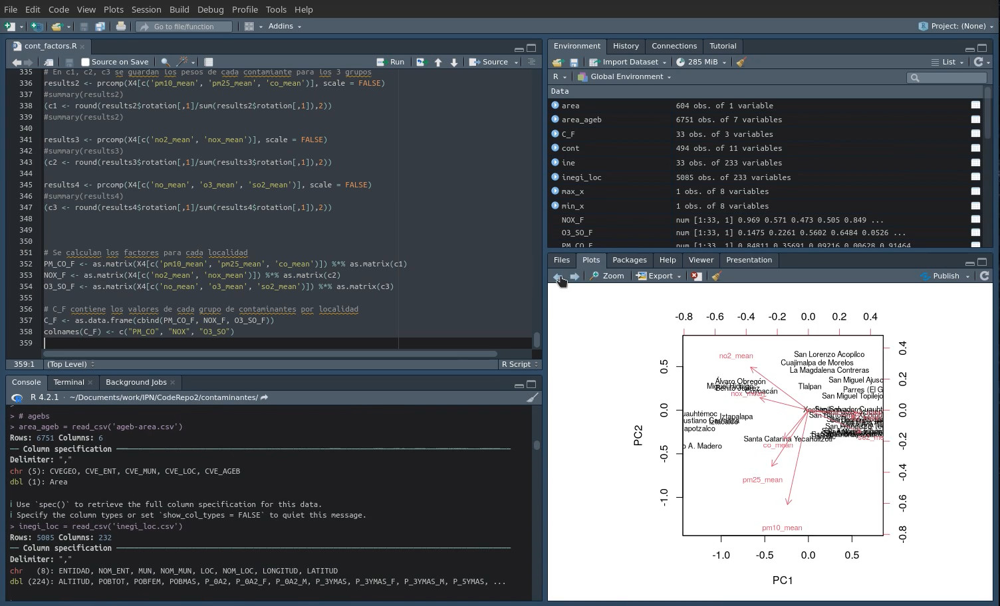

# Desarrollo de factores de contaminantes atmosféricos para el análisis de datos de salud en la Ciudad de México
La contaminación atmosférica es un importante factor de riesgo medioambiental para la salud humana, y las exposiciones a corto y largo plazo están relacionadas con la mortalidad prematura y la reducción de la esperanza de vida. Por ejemplo, estudios han hallado asociaciones entre la diabetes y la exposición a partículas (PM10, PM2,5) y a contaminantes relacionados con el tráfico (NO2).

Por ello, es importante crear índices de la contaminación atmosférica para rastrear y cuantificar con precisión su efecto, y utilizar los Sistema de información geográfica (SIG) para identificar patrones y tendencias con el fin de orientar las intervenciones dirigidas a reducir estos riesgos.

Para investigar el impacto de los contaminantes atmosféricos, deben incluirse en el análisis múltiples contaminantes atmosféricos. Sin embargo, es importante señalar que, en la Ciudad de México, las concentraciones de estos contaminantes están correlacionadas espacialmente, por lo que un análisis estadístico que no tenga en cuenta este hecho podría dar lugar a estimaciones incorrectas de los efectos de cada contaminante. Por lo tanto, los factores de contaminantes se construyeron agrupando los contaminantes altamente correlacionados por ubicación, utilizando el análisis de componentes principales para preservar tanta información sobre los contaminantes como fuera posible, para ser utilizados en análisis posteriores.

**Proyecto CONACyT**: Observatorio de datos para descubrimientos de patrones Sociales-EspacioTemporales en Salud, Movilidad y Calidad del Aire.

**Número**: 7051.

**Objetivo**: Definir las bases de interoperabilidad para homologar la información de las bases de datos de salud, y obtener datos precisos y confiables, que permitan tener series históricas y generar la trazabilidad de los pacientes, en especial de aquellos que padecen enfermedades crónicas no transmisibles, así como la construcción de indicadores de salud y su relación con la exposición a contaminantes atmosféricos. 

## Datos abiertos utilizados:
[Censo de Población y Vivienda 2020 (INEGI)](https://www.inegi.org.mx/programas/ccpv/2020/)

[Datos de calidad de aire de la Ciudad de México](http://www.aire.cdmx.gob.mx/default.php?opc=%27aKBhnmM=%27)

## Uso
Ejecutar `Rscript cont_factors.R` ó cargar y ejecutar en RStudio.




## Requisitos
```
tidyverse==1.3.2
stringr==1.4.1
psych==2.2.9 
car==3.1-1 
```

### Lista de archivos
[cont_factors.R](cont_factors.R): Código R/RStudio para generar los factores de contaminantes atmosféricos.

[cont_pca.pdf](cont_pca.pdf): Análisis de componentes principales para los contaminantes atmosféricos en diferentes localidades de la Ciudad de México.

[cont_loc_mean.csv](cont_loc_mean.csv): Archivo generado por los autores, con las concentraciones medias de exposición a contaminantes atmosféricos por localidad, durante el periodo 2005-2020, generadas por Kriging y QGIS.	

[ageb-area.csv](ageb-area.csv): Archivo generado por los autores, con estimaciones de superficie por localidad, usando QGIS.

[inegi_loc.csv](inegi_loc.csv): Datos del Censo de Población y Vivienda 2020, INEGI.

[pesos_cont.pdf](pesos_cont.pdf): Ponderaciones obtenidas para los distintos contaminantes atmosféricos para la generación de los tres factores de contaminantes.


## Citar

```bibtex
@software{cont_factors,
  title = {{Desarrollo de factores de contaminantes atmosféricos para el análisis de datos de salud en la Ciudad de México}},
  author = {Carlos Minutti},
  url = {https://github.com/cminuttim/cont_factors/},
  month = {3},
  year = {2023},
  version = {0.1},
}
```
